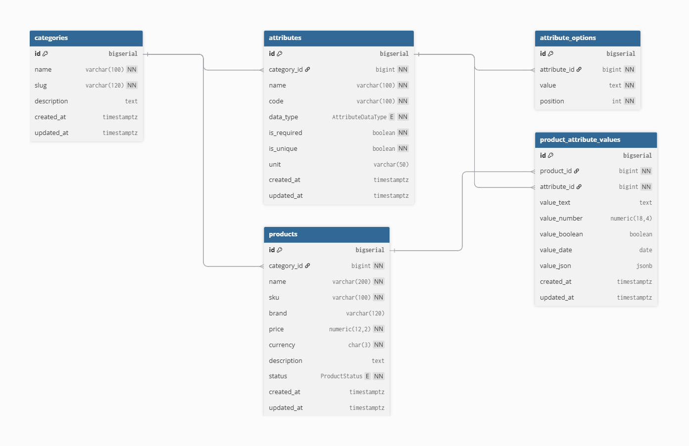
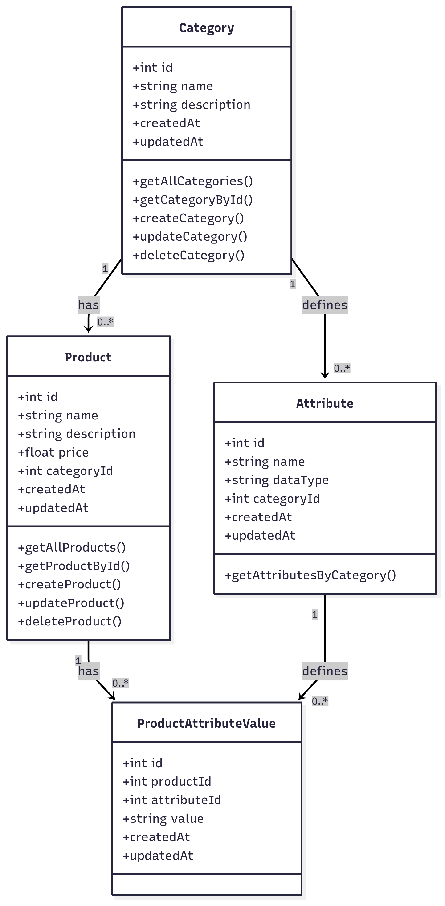

# Internal Product Management Tool

## 1. ERD Diagram
  

**Justification:**  
The database is normalized to reduce redundancy.  
- **Products**, **Categories**, **Attributes**, and **ProductAttributeValues** are separated for flexibility.  
- One-to-many between **Categories** and **Products**; many-to-many between **Products** and **Attributes** via **ProductAttributeValues**.  
- Supports dynamic addition of products, categories, and attributes, making the system future-proof.

---

## 2. Class Diagram
  

**Explanation:**  
- **Product**: Holds product information and belongs to a **Category**.  
- **Category**: Groups products logically.  
- **Attribute**: Defines dynamic fields for products.  
- **ProductAttributeValue**: Links products and attributes, storing specific attribute values per product.  
- This design ensures clean relationships, easy CRUD operations, and flexibility to add new attributes.

---

## 3. Tech Stack
- **Frontend:** React + Vite + Plain CSS  
- **Backend:** Node.js + Express  
- **Database:** PostgreSQL + Sequelize ORM  
- **Tools:** Postman (API testing), dotenv (env config)

---

## 4. Backend & APIs

### Backend Structure
- **Models:** `Product`, `Category`, `Attribute`, `ProductAttributeValue`  
- **Controllers:** CRUD logic for Products and Categories  
- **Routes:** `/api/products`, `/api/categories`, `/api/attributes`  

### API Endpoints
**Products**
- `GET /api/products` – Fetch all products with categories & attributes  
- `GET /api/products/:id` – Fetch single product  
- `POST /api/products` – Create a new product with attributes  
- `PUT /api/products/:id` – Update a product and its attributes  
- `DELETE /api/products/:id` – Delete a product  

**Categories**
- `GET /api/categories` – Fetch all categories  
- `POST /api/categories` – Add a new category  

**Attributes**
- `GET /api/attributes?categoryId=` – Fetch attributes for a category  
- `POST /api/attributes` – Add a new attribute (if implemented)

---

## 5. Setup & Installation

### Backend
```bash
# Install dependencies
cd backend
npm install

# Create .env file
DB_HOST=localhost
DB_NAME=productdb
DB_USER=your_db_user
DB_PASS=your_db_password
PORT=5000

# Run server
npm run dev
