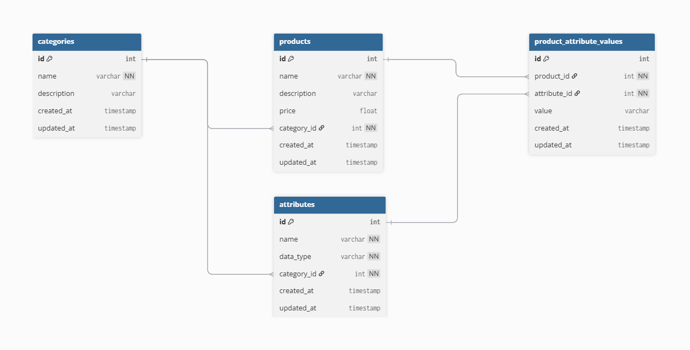

# Internal Product Management Tool

## 1. ERD Diagram
  

**Justification:**  
- **Normalization & structure**: Products, Attributes, and Categories are separated to avoid redundancy.
- **Flexibility**: Attributes are linked to categories, allowing different categories to have different sets of attributes.
- **Future-proofing**: ProductAttributeValues allows storing values for any attribute dynamically without changing table structure.

---

## 2. Class Diagram
  

**Explanation:**  
### Category
- Stores product categories.
- Methods represent API endpoints for CRUD operations.

### Product
- Stores product info linked to category.
- Methods represent API endpoints for CRUD operations.

### Attribute
- Stores category-specific attributes like Color, Size, Brand.
- Can fetch attributes by category.

### ProductAttributeValue
- Stores the actual attribute values for products.
- Acts as a join table between Product and Attribute.

### Relationships
- 1 Category → N Products
- 1 Category → N Attributes
- 1 Product → N ProductAttributeValues
- 1 Attribute → N ProductAttributeValues

---

## 3. Tech Stack
- **Frontend:** React + Vite + Plain CSS  
- **Backend:** Node.js + Express  
- **Database:** PostgreSQL + Sequelize ORM  
- **Tools:** Postman (API testing), dotenv (env config)

---

## 4. Backend & APIs

### Backend Structure
- **Models:** `Product`, `Category`, `Attribute`, `ProductAttributeValue`  
- **Controllers:** CRUD logic for Products and Categories  
- **Routes:** `/api/products`, `/api/categories`, `/api/attributes`  

### API Endpoints
**Products**
- `GET /api/products` – Fetch all products with categories & attributes  
- `GET /api/products/:id` – Fetch single product  
- `POST /api/products` – Create a new product with attributes  
- `PUT /api/products/:id` – Update a product and its attributes  
- `DELETE /api/products/:id` – Delete a product  

**Categories**
- `GET /api/categories` – Fetch all categories  
- `POST /api/categories` – Add a new category  

**Attributes**
- `GET /api/attributes?categoryId=` – Fetch attributes for a category  
- `POST /api/attributes` – Add a new attribute 

---

## 5. Setup & Installation

### Backend
```bash
# Install dependencies
cd backend
npm install

# Create .env file
DB_HOST=localhost
DB_NAME=productdb
DB_USER=your_db_user
DB_PASS=your_db_password
PORT=5000

# Run server
npm run dev

```
### Frontend
```bash
# Install dependencies
cd frontend
npm install

# Run dev server
npm run dev
```

- Backend runs on http://localhost:5000
- Frontend runs on http://localhost:5173 (default Vite port)


## 6. Future Implementation

-	Adding inventory management and supplier linking.
-	Product variant support (size, color combinations).
-	Role-based access control for admin and staff users.
-	Enhanced UI with responsive design and better UX.


